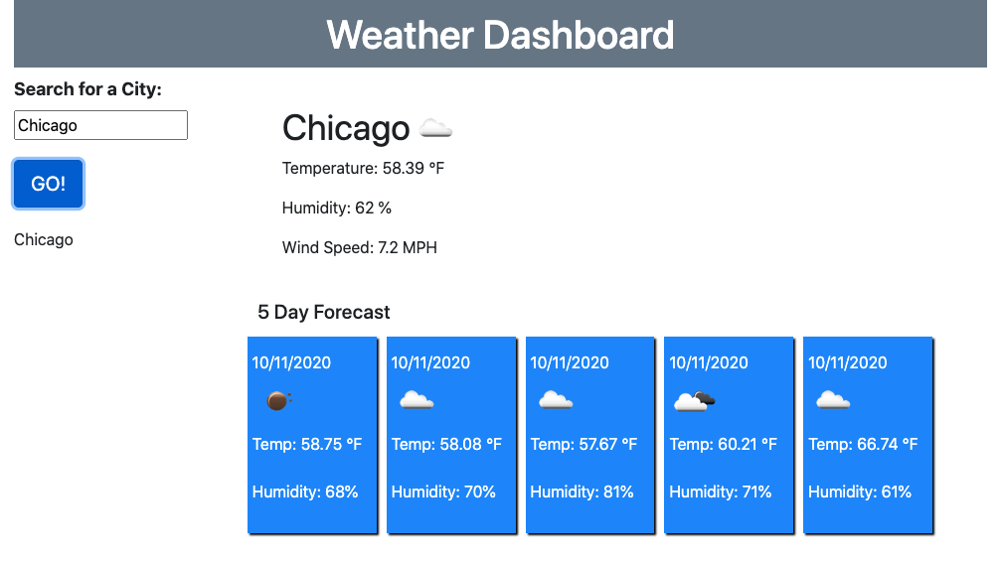

# weather-dashboard-hw

PROJECT DESCRIPTION

This Northwestern University Coding Bootcamp HW assignment was creating a weather dashboard that displays the current weather and the five day forecast based on the city name that the user submits via in input form. The OpenWeather API was used to pull weather data into the application. Styling mimics the assignment recommendations.

SCREENSHOTS

TECHNOLOGY
HTML, CSS, Javascript, Bootstrap, Moments.js and the OpenWeather API were used to create this project.

FUTURE DEVELOPMENT

In future developments I would like to finalize functionality around saving searches so users can click on past weather searches and populate the data back. I would also like to add color coding to the UV index data.